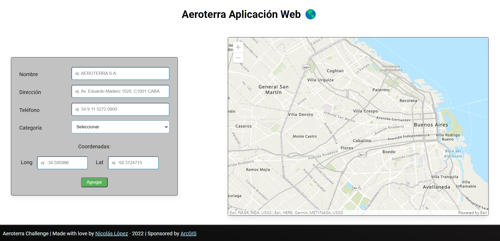
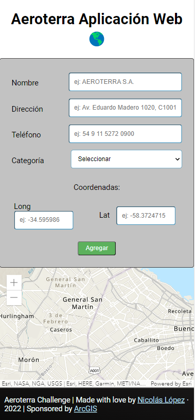

# **Aeroterra desafio | Aplicacion Web**
## Autor: *Nicolas Lopez*

## **Instrucciones**
* Doble click al archivo index.html (es decir, abrir el archivo index.html en un navegador) y no requiere más.

## **Resumen del proyecto**
### Desktop

### Mobile

* Se puede apreciar un mapa y un formulario.
* Se pueden agregar punteros con información al mapa desde el formulario hermano.
* Se pueden seleccionar los punteros en el mapa ampliando información del mismo.

## **Tecnologias**
* Tecnologías vanillas
* HTML5
* CSS3
* JavaScript
* ArcGIS API
* Markdown for this document

## **Contacto**
* Nicolas Lopez
*
* [LinkedIn](https://www.linkedin.com/in/nicogamy/)
* email: madrazonecogamy@gmail.com